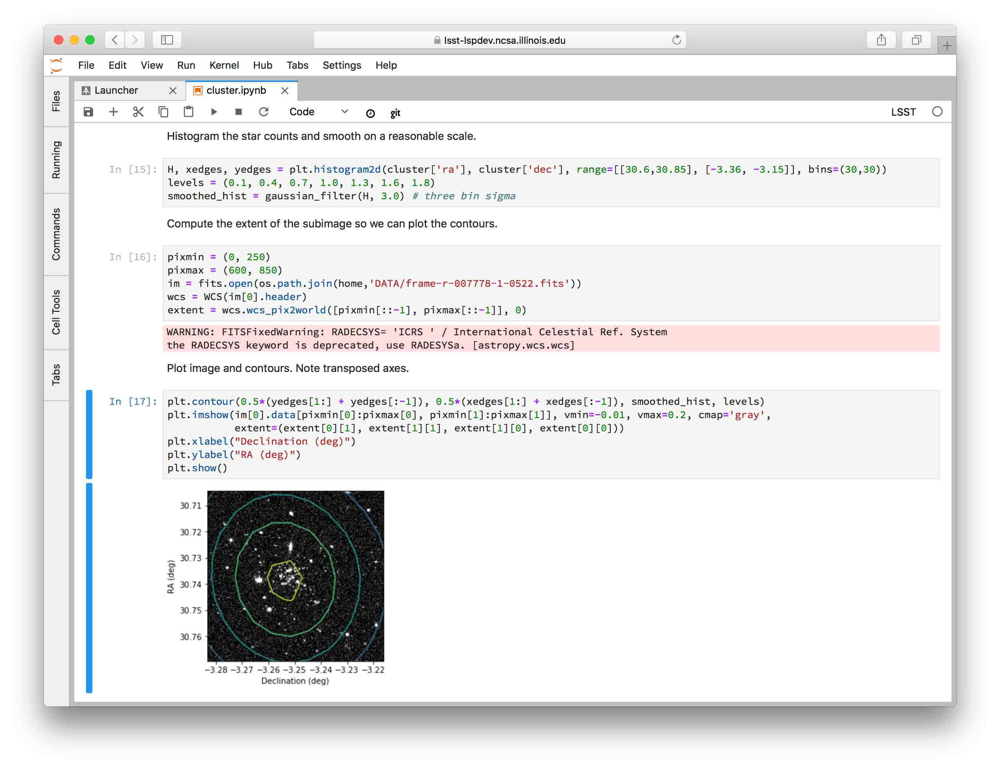
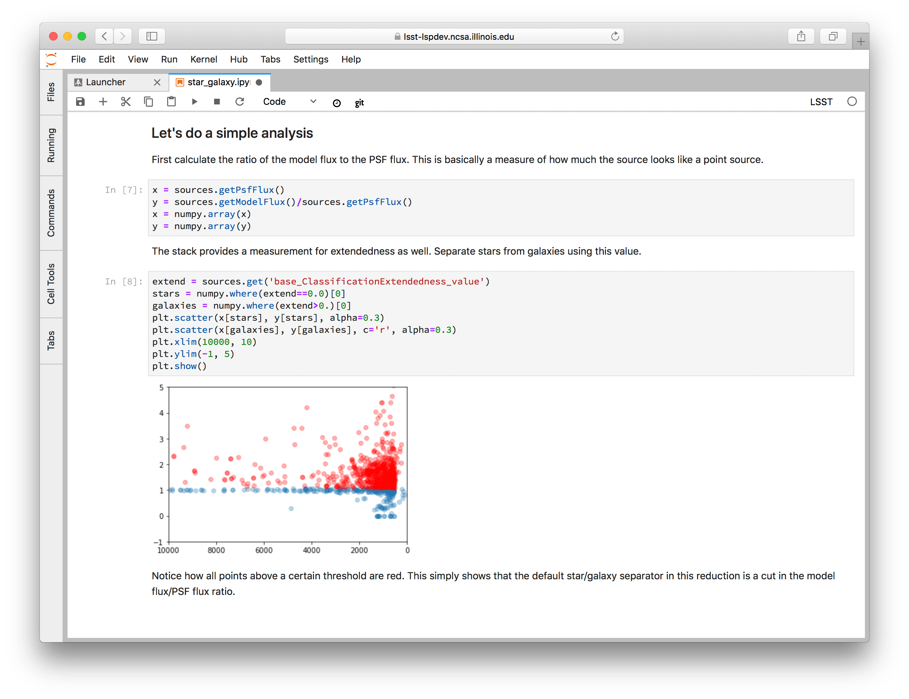

##############
Demo notebooks
##############

The Notebook Aspect is preloaded with demo notebooks to help you learn about notebook-based computing and inspire your own work on the platform.

Using the demo notebooks
========================

You can find these notebooks in the :file:`notebooks/notebook-demo` directory of the `JupyterLab file browser <https://jupyterlab.readthedocs.io/en/latest/user/files.html>`_.
Double click the directory, then double click on the notebook to open it.
You can click **Run** → **Run all Cells** to run the entire notebook, or type :kbd:`shift`\ -\ :kbd:`return` to run one cell at a time.

In the `terminal <https://jupyterlab.readthedocs.io/en/latest/user/terminal.html>`_, you can find ``notebook-demo `` in the ``~/notebooks`` directory.

.. note::

   The :file:`notebooks/notebook-demo` directory is hosted at https://github.com/lsst-sqre/notebook-demo.
   Every time you log into the Notebook Aspect, the default branch (called ``prod``) is updated from GitHub.
   Avoid running :command:`git commit` on the ``prod`` branch.

Notebooks
=========

cluster.ipynb (Whiting I)
-------------------------

This notebook explores a very simple analysis to show the utility of notebooks in general, and some of the features of the JupyterLab environment specifically.

This notebook uses data from DR14 of the SDSS survey, using the globular cluster Whiting I as a starting point.

Firefly.ipynb (Firefly Visualization Demo)
------------------------------------------

This notebook is intended to demonstrate the Firefly interactive interface for viewing image data.
It also builds on the pedagogical explanations provided in the `Getting started tutorial <https://pipelines.lsst.io/getting-started/display.html>`__ of the LSST Science Pipelines documentation.

This tutorial seeks to teach you about how to use the LSST Science Pipelines to inspect outputs from ``processCcd.py`` by displaying images and source catalogs in the Firefly image viewer.
In doing so, you’ll be introduced to some of the LSST Science Pipelines’ Python APIs, including:

-  Accessing datasets with the ``Butler``.
-  Displaying images with ``lsst.afw.display``.
-  Pass source catalog data directly to the ``FireflyClient``.

star_galaxy.ipynb (A very simple example of star/galaxy separation)
-------------------------------------------------------------------

This notebook uses the LSST Science Pipelines’s Butler to get an Exposure and source table, and then use the ``base_ClassificationExtendedness_value`` to classify sources as stars or galaxies.
The notebook shows how to use Matplotlib to visualize the sources on the exposure, and analyze the performance of the star-galaxy classifier.

More notebooks
==============

See :doc:`repositories` to discover more notebooks being shared by LSST and the community.
