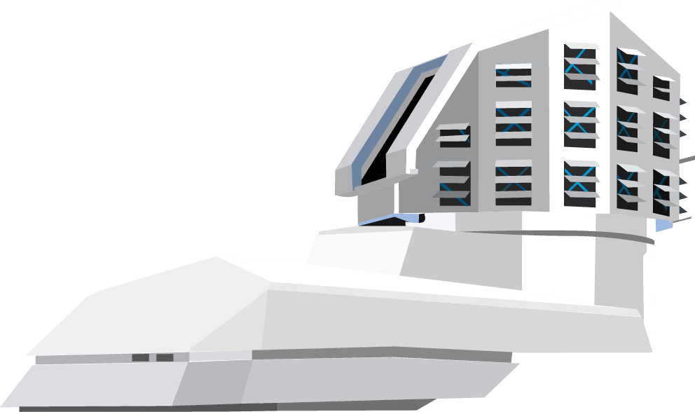

####################################################
Rubin Science Platform Notebook Aspect Documentation
####################################################

The Notebook Aspect enables you to do your science in your web browser by creating and running Jupyter Notebooks next to the data within the |rsp-at|.
The Notebook Aspect is powered by the JupyterLab_ project.

|log-in|

.. jinja:: rsp

   
   .. important::

      This documentation covers the |rsp-at|, an environment for Rubin Observatory staff.
      For :abbr:`DP0.1 (Data Preview 0.1)`\ , please use the `Notebook Aspect documentation for the IDF (Interim Data Facility) <https://nb.lsst.io>`__\ .
   

Getting started
===============

.. toctree::
   :maxdepth: 1

   getting-started/account
   getting-started/logging-in
   getting-started/repositories
   getting-started/logging-out
   getting-started/getting-help

Using the LSST Science Pipelines
================================

.. toctree::
   :maxdepth: 1

   science-pipelines/science-pipelines-in-terminals
   science-pipelines/science-pipelines-in-notebooks
   science-pipelines/development-tutorial

Environment
===========

Software and data:

.. toctree::
   :maxdepth: 1

   environment/directories
   environment/python
   environment/installed-software
   environment/jupyterlab-extensions

Configuration:

.. toctree::
   :maxdepth: 1

   environment/shell-configuration
   environment/git-configuration

Tokens:

.. toctree::
   :maxdepth: 1

   environment/tokens

Project info
============

.. toctree::
   :maxdepth: 1

   project/implementation
   project/contributing
   project/environment-specific-documentation
   project/rsp-environments-yaml
   project/license

.. _JupyterLab: https://jupyterlab.readthedocs.io/en/latest/
.. _LSST Science Pipelines: https://pipelines.lsst.io
